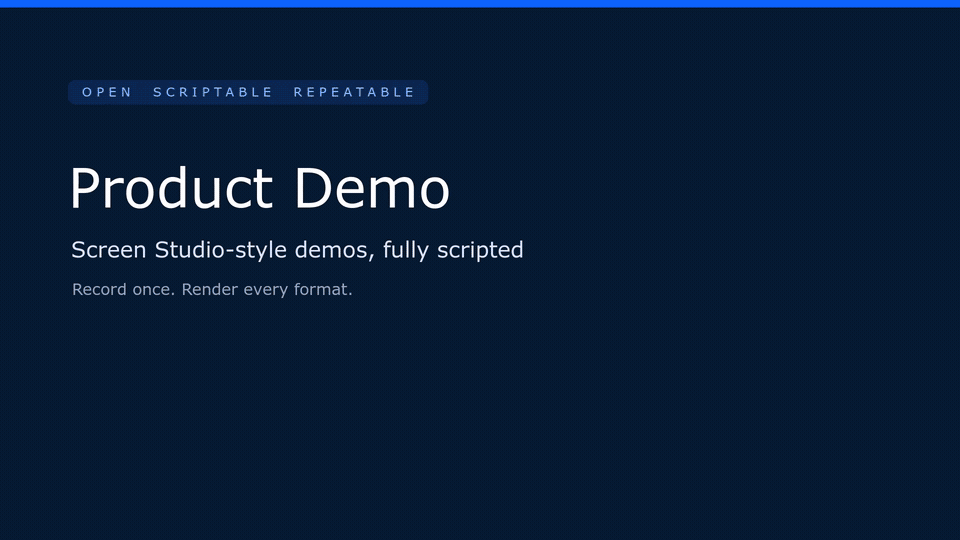
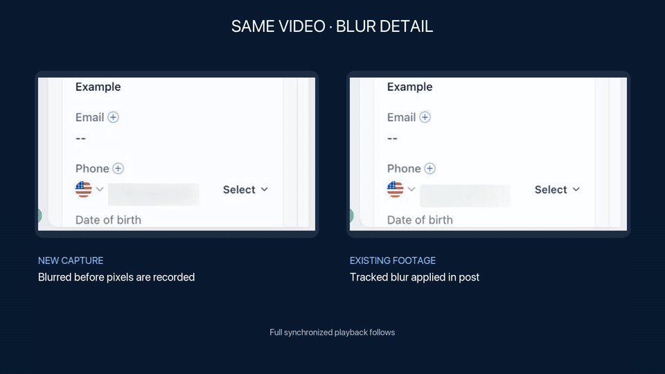

# Scripted Product Demo

An open Agent Skill from [Moosh Works](https://mooshworks.com/skills/) for creating polished, repeatable real-product walkthroughs. It records real interactions and renders smooth, telemetry-driven demo videos in source, wide, vertical, square, classic, and tall formats, with optional persistent cursor-follow framing.

The workflow adds a reconstructed cursor, click-synchronized camera moves, caret-follow typing, tactile click feedback, source-tracked privacy masks, branded framing, action captions, and reproducible MP4 output while keeping private sessions and product-specific working renders out of git. One capture can produce every supported format through action-aware reframing rather than fixed center crops.

Scripted Product Demo automates capture and motion polish. It is not a clone or full replacement for Screen Studio’s desktop editor.

## See It in Motion

Click either animated preview to watch the full H.264 MP4 with sound.

### Screen Studio-Style Polish, Fully Scripted

[](examples/screen-studio-style-product-demo.mp4)

Record one real flow, then apply smooth camera moves, cursor motion, typing focus, click feedback, captions, and aspect-aware reframing through code.

### Privacy From Capture Through Export

[](examples/privacy-blur-comparison.mp4)

New recordings can blur a measured DOM element before its pixels are captured. Existing footage uses the same tight element bounds inside the transformed source layer, so the blur follows every camera move without covering neighboring controls.

The repository includes a tested TypeScript engine template under [`skills/scripted-product-demo/assets/engine`](skills/scripted-product-demo/assets/engine). It provides the reusable camera, cursor, caret, privacy-mask, typing-to-submit, and aspect-ratio logic. Product adapters keep their selectors, real workflow, branding, captions, and compositor shell.

Channel-specific skills can wrap this core for YouTube production, personal-brand presentation, or Marketplace review requirements without duplicating the capture and motion system.

## Install

Install globally with the open `skills` CLI:

```bash
npx skills add mooshee/product-demo --skill scripted-product-demo -g
```

The installable payload lives in `skills/scripted-product-demo/`, so the CLI includes its scripts, references, and engine rather than only the instruction file.

Restart the host application if the skill is not discovered in the current session.

## Use

```text
Use $scripted-product-demo to record a polished walkthrough of this product’s core workflow.
```

The skill adapts to the target repository. It does not bundle an authenticated browser profile, product footage, a third-party click recording, or a product-specific flow.

To seed a product adapter with the reusable engine from a repository checkout:

```bash
./skills/scripted-product-demo/scripts/install-engine.sh path/to/product-demo-engine
cd path/to/product-demo-engine
npm ci
npm test
npm run typecheck
```

## More Open Skills

Explore the [Moosh Works Open Skills catalog](https://mooshworks.com/skills/) or try [ChatGPT Query Research](https://github.com/mooshee/chatgpt-search-query-mining), an experimental skill for turning a controlled ChatGPT query cluster into a source-backed content plan.

## Author & License

Built by [Daniel Hallman](https://github.com/mooshee) at [Moosh Works](https://mooshworks.com/).

The skill instructions and scripts are MIT licensed. Third-party sources and reference assets retain their own licenses; see [THIRD_PARTY_NOTICES.md](THIRD_PARTY_NOTICES.md).
